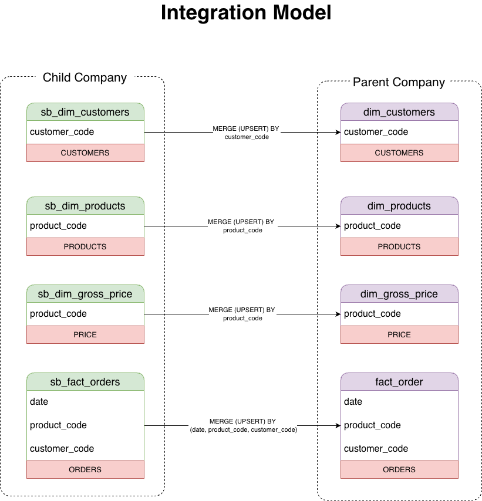
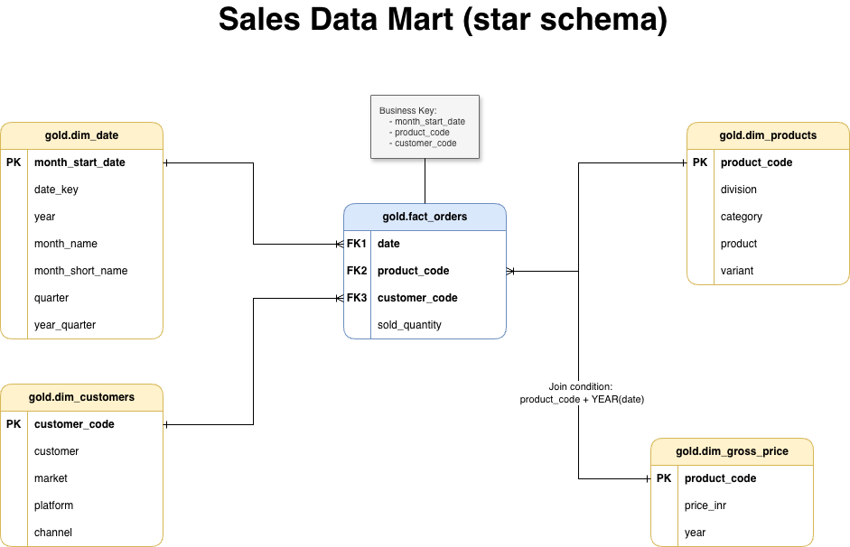
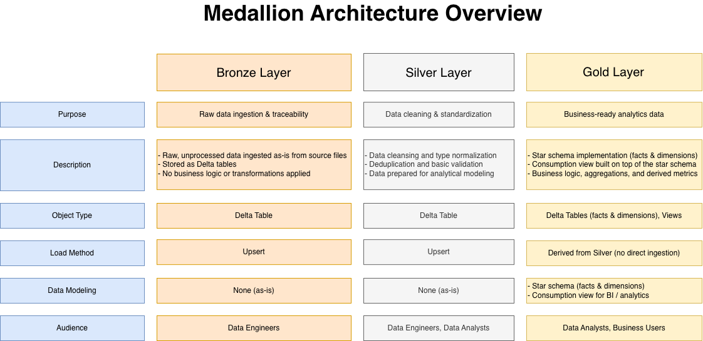
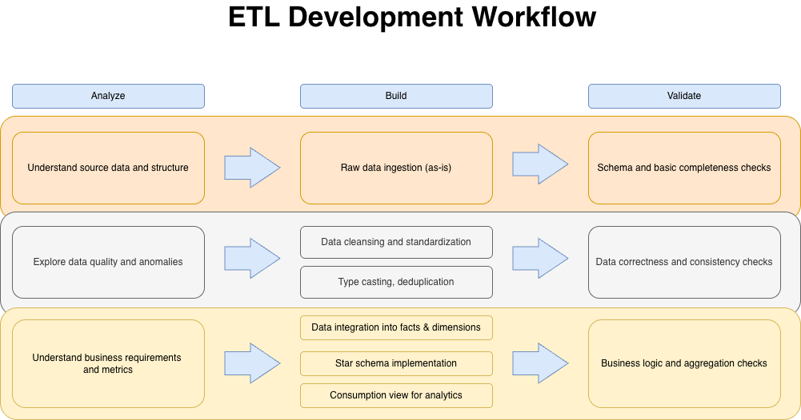
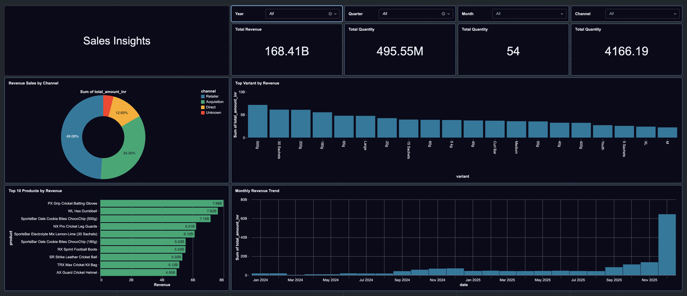

## Databricks Sales Data Warehouse (Medallion Architecture)

This repository contains an analytical data warehouse implemented in **Databricks** using **Delta Lake** and the **Medallion Architecture (Bronze → Silver → Gold)** approach.

The project demonstrates a practical Data Engineering implementation, including raw data ingestion from CSV files, data cleansing and standardization, data integration, analytical modeling, and preparation of business-ready datasets for BI dashboards and ad-hoc analytics.

## 1. Architecture Overview

The solution follows the **Medallion Architecture** model:

Bronze Layer

Stores raw data ingested from CSV files. No transformations are applied; data is preserved in the original source format.

Silver Layer

Contains cleansed and standardized data. This layer performs data type normalization, NULL handling, and basic data preparation.

Gold Layer

Contains business-ready data modeled as a **star schema**:

- `fact_orders`
- `dim_customers`
- `dim_products`
- `dim_date`
- `dim_gross_price`

The Gold layer is designed for analytics, reporting, and ad-hoc SQL queries.

## 2. Data Flow

Data is ingested from file-based sources:

- Customers
- Products
- Gross Prices
- Orders

Processing pipeline:

- Bronze → Silver
    
    Data cleansing, standardization, and preparation.
    
- Silver → Gold
    
    Data integration and construction of fact and dimension tables.
    
- Gold → View
    
    Creation of the analytical view `vw_fact_orders_enriched`.

## 3. Integration Model

Data integration is performed using business keys:

- **Product** — `product_code`
- **Customer** — `customer_code`
- **Gross Price** — (`product_code`, `year`)
- **Fact Orders** — (`month_start_date`, `product_code`, `customer_code`)

Integration is implemented using **MERGE (UPSERT)** operations, ensuring correct incremental loading and updates.

## 4. Analytical Model (Gold Layer)

The Gold layer implements a **star schema** optimized for analytical workloads.

**Fact table**

- `fact_orders`
    - aggregated sales data
    - grain: month_start_date × product_code × customer_code

**Dimension tables**

- `dim_customers`
- `dim_products`
- `dim_date`
- `dim_gross_price`

An additional analytical view is created:

- `vw_fact_orders_enriched`

The view joins the fact table with all dimensions and includes derived metrics such as total sales amount.

## 5. Technical Scope

Ingestion (Bronze)

- Source format: CSV files (AWS S3)
- Batch loading into Delta tables
- Data ingested **as-is**, without transformations
- Source schema preserved
- Idempotent load supported

Transformation (Silver)

The Silver layer performs the following operations:

- Data type normalization
- Data cleansing
- Deduplication
- NULL handling
- Schema alignment

Modeling (Gold)

- Integration of Parent and Child company data
- Incremental loading using `MERGE (UPSERT)`
- Construction of fact and dimension tables
- Star schema implementation
- Creation of an analytical view for BI

## 6. Medallion Architecture Overview

This diagram highlights the differences between Bronze, Silver, and Gold layers, including:

- object types
- transformation level
- load strategy
- target audience

## 7. ETL Development Workflow

The ETL process follows a standard development cycle:

- data analysis
- transformation development
- data validation

This workflow reflects common enterprise ETL development practices.

## 8. Analytics & Visualization

- Databricks SQL Dashboard built on top of Gold layer views
- Uses `vw_fact_orders_enriched` as the primary semantic dataset
- Supports business analysis by customer, product, market, and time

## 9. Repository Structure

add

## 10. Error Handling

To ensure analytical stability, default handling is implemented:

- Records with missing or invalid `customer_code` are mapped to **Unknown Customer (99999)**
- This prevents data loss and ensures stable aggregations in BI dashboards

## 12. Data Quality Controls

Data quality checks are applied at different layers:

Silver Layer

- NULL checks
- Deduplication
- Data type validation

Gold Layer

- Fact grain validation
- MERGE condition checks
- Aggregation validation

## 13. Use Cases

The project demonstrates capabilities relevant for the following roles:

- Data Engineer
- Analytics Engineer
- BI Developer
- ETL / DWH Engineer

## 14. Technologies

- Amazon S3 (CSV files as source systems)
- Databricks
- Apache Spark (Spark SQL)
- Delta Lake
- Medallion Architecture
- Databricks Workflows (pipeline orchestration)
- Databricks SQL Dashboards (analytics & visualization)
- Draw.io (architecture and data modeling diagrams)
- Git & GitHub
